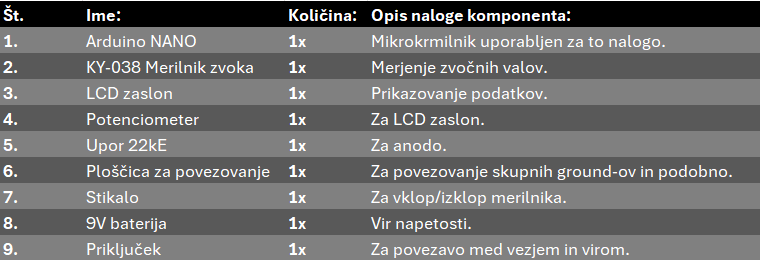
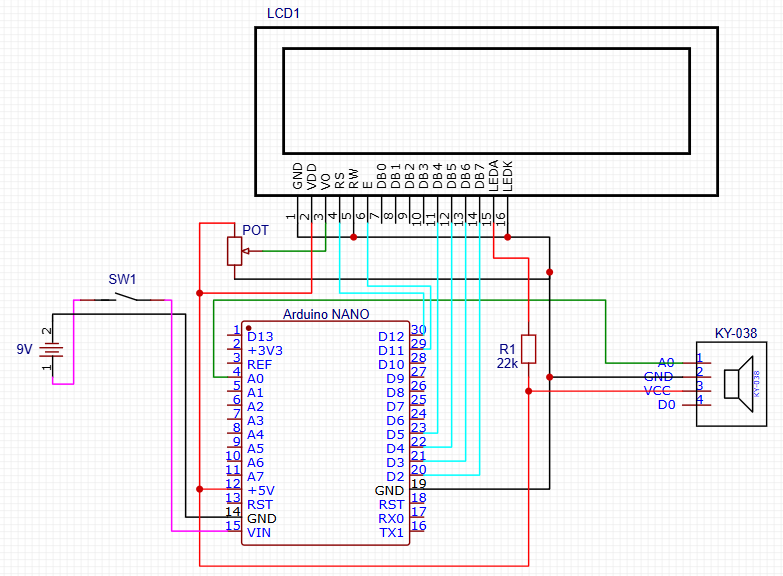

# Merilnik-zvoka
# Kratek opis

Za nalogo sva izdelala merilnik zvoka z uporabo zvočnega senzorja KY-038, ki vsebuje kondenzatorski mikrofon za zaznavanje zvočnih valovov. Uporabila sva tudi mikrokrmilnik Arduino NANO.
Merilnik deluje na principu znočnega senzorka KY-038, ki preko mikrofona zaznava zvočne valove, na to oddaja analogni signal, katerega ojačevalnik procesira in dobimo digita output.

# Komponente in kosovnica

KY-038 Merilnik zvoka (1x), Arduino NANO (1x), LCD zaslon (1x), Potenciometer (1x), Upor 22kE (1x), Ploščica za povezovanje (1x), Stikalo (1x), 9V baterija (1x) in priključek (1x).

# Slika vezja v programu Easy EDA

# Slika ohišja v programu Onshape

# Slika pokrova za ohišje v programu Onshape

# Video delovanja

https://github.com/user-attachments/assets/a67a9703-8960-41f6-a9c3-827bbacc960b

# Končne slike delovanja

# A-test (tabela meritev)

# Komentar 

V šoli izdelana naprava ima povprečno odstopanje ±3,99 dB ter omejitev pri 180 dB.

# Možne izboljšave

- Druga pozicija merilnika zvoka
- Uporaba dejanske referenčne naprave
- 

